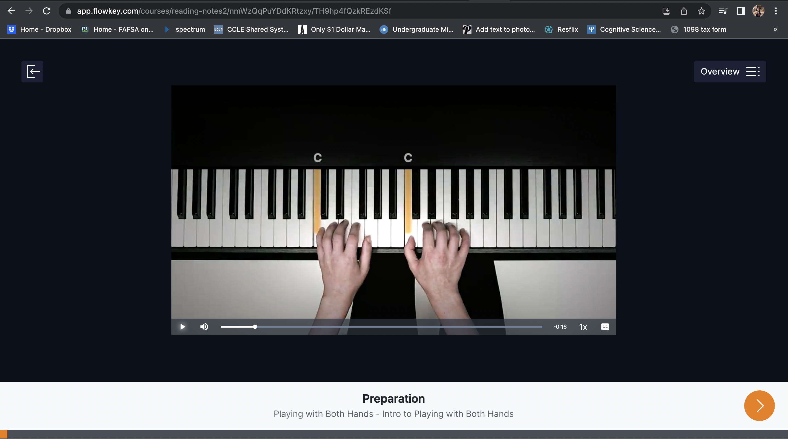

# Assignment 1: Heuristic Evaluation | Yahaira Cortez - DH110

## Tentative Title: YouTune

It is no surprise at any age or stage in life, one might feel the need to learn music, especially learning a musical instrument. Whether it is a sense of nostalgia or simply a new curisoity, learning a musical insturment is a common hobby, and has been for decades. As someone who has grown up learning insturments, however, I can testify to the difficulty in learning an instrument, moreso when without access to in-person instructors. Especially during times like today, in-person instructors may be not always be an viable option, which makes online music learning services/app even more crucial. 

Online music learning services provides better access to those who seek to learn a musical instrument, however, the accesibility may be hindered by how the techonology of the service is utilized. With my UX project, I want to make online music learning serivces, specifically those teaching musical instruments, easy to navigate without hindering the quality of musical teaching. I want my project to especially take into account older audiences, such as middle-aged men, and redesign the interface such that the majority of those within the group are better able to utilize the music learning service.  
 
The following evaluations are based using <a href="https://www.nngroup.com/articles/ten-usability-heuristics/" target="_blank">10 Usability Heuristics for User Interface Design</a> and <a href="https://www.nngroup.com/articles/how-to-rate-the-severity-of-usability-problems/" target="_blank"> Severity Ratings for Usability Problems</a>. 

## Flowkey  

**FlowKey** is music learning website that provides piano lessons to indivudals ranging from novice to advanced. Users are able to pick which piano lessons to take - entire modules or individual lessons. Users are also able to learn songs from a wide range of genres from their large music library. The service allows users to follow along with videos and prompts users to either connect their piano to the computer or listens to the user's piano using the microphone to test the user on their progress throuhgout the lesson. 

   

**Evaluation:** Overall the webstie is simple and easy to naviagte, however, might be too simple for inexperienced users. The lack of guidance can make it difficult for those who may not be as experienced with technology. The sizing of the text may also hinder the ability of users who have difficulty seeing.    

| 
 **Heuristic & Description** 
 | 
 **Evaluation** 
| 
 **Improvement Reccomendations** 
|
 **Severity Rating** 
|
| --------------------------------------- | ------------------------------------- |------------------------------------- |------------------------------------- |
| **1. Visibility of System Status:**   The website/app clearly communicates the system's status to the user and presents feedback to user within reasonable of actions they are currently doing. | **Good:** The user is able to track their progress in the lesson at the bottom of the screen. The user is also able to check their progress in the module by clicking the lesson outline. Above the progress bar at the bottom of the screen, the user is able to check which lesson they are currently in.  **Bad:** The user is not able to check their progress within the module outline while taking lesson - lesson is paused to view progress. The module outline also pops up in the center of the screen which may cause inconvenience in comparison to having it pop up as a sidebar.  | If user chooses to view the module outline, have outline pop-up as a sidebar. Allow user the option to have outline hidden or viewable during lesson as a sidebar.  | 
 2 
 |
| **2. Match Between System and the Real World:**   The website/app uses language that is familar to the user, rather than system-oriented terms, and presents information similarly to the real world. | **Good:** The website uses familar language and text that are also analagous to the real world. Labels are simple and help user navigate site  | No reccomendations for improvement. | 
 0 
 |
| **3. User Control and Freedom:**   The website/app allows user to easily undo an unwanted action. Supports undo and redo. | **Good:** User is able to easily exit lesson and skip through videos or portions of lesson.  **Bad:** Back or Exit options disappear if user is not actively moving mouse. User has to hover over top area of the site to access exit option. | Always have back or exit options/icons visible, rather than only when user hovers over the designated area on the screen. | 
 3 
 |
| **4. Consistency and Standards:**   The website/app follows typical conventions of other apps/websites. | **Good:** Typical web page layout with navigation bar and is consistent across pages.   **Bad:** The web layout changes when entering the lesson - tools are across (left-right) top area of page whereas tools, or navigation, are on the left side (from top-bottom) of the page during lessons. Icons and tools are always visible in song lessons but are not always visible during lessons relating to piano fundementals. | Make lessons have similar layout to the homepage to avoid confusion and to prevent user from having difficulty in findings tools/resources. Have all lessons have similar web layouts. | 
 3 
 |
| **5. Error Prevention:**   The website/app prevents error-prone conditions or checks for errors and notifies user before commiting an action. | **Good:** Asks user for confirmation when clicking on song they choose they learn. Automatically saves user's progress.   **Bad:** Does not ask for user confirmation when exiting an lesson or when choosing a lesson to complete.| Notify user before committing an action which may hinder or interfere with their progress, such as exiting any lesson (song or piano fundamentals) |  
 2 
 |
| **6. Recognition Rather than Recall:**    The website/app minimizes recall and instead makes icons, labels, actions visible to user. | **Good:** labels, icons, and actions are always visible on homepage and when navigating other pages from homepage.   **Bad:** Upon entering lessons relating to piano fundamentals, tools and icons are only visible when hovering over designated area on site. Users must recall the area where the back and lesson outline buttons are in order to access them.  | Have icons and tools always visible during lessons relating to piano fundamentals | 
 2 
 |
| **7. Flexibility and Efficiency of Use:**   The website/app is customizable such that the functions can cater to beginners and experts. | **Good:** Website is simple and easy to navigate for all ranges of technological experience.   **Bad:** Site is not really customizable and only difference between novice and advanced users is the difficulty of the lessons, the web layout never really changes. | Allow users to customize the site such that they can include other tools for learning music on screen during lessons, such as a metronome.| 
 1 
 |
| **8. Aesthetic and Minimalist Design:**   The website/app only contains needed and relevant information. | **Good:** The website is simple and only contains relevant and necessary information.  | No reccomendation for Improvement. | 
 0 
 |
| **9. Help Users Recognize, Diagnose, and Recover from Errors:**   The website/app presents user with clear error messages, indicating the error and providing a solution. | **Good:** Website provides clear error messages with proper explanation of the error and suggested solutions | No reccomendation for Improvement |  
 0 
 |
| **10. Help and Documentation:**   The website/app provides understandable and easily accessible documentation for understanding how to complete the task at hand, if needed. | **Good:** Website gives proper feedback to user when navigating site and offers understandable instructions for what is gong on within lessons and subpages.   **Bad:** Website offers little guidance for how to navigate site - most navigation is based on icons and labels on navigation tab. No FAQ page or extra outside documentation for understanding how to use service or how to handle errors. | Include optional video tutorial for how to navigate site. Include link or icon to lead user to documentation with extra information on how to utilize service or how to confront errors the user may encounter. |  
 3 
 |    

## GuitarTricks  

**GuitarTricks:** is an online music learning site that offers guitar learning video lessons for novice to advanced users. Their wide range of lessons allows users to choose certain modules specific instructors, modules based on playing level, modules based on style of guitar, and/or learn songs of their choice on guitar. 

   

**Evaluation:** Overall the site is difficult to navigate as the site is overloaded with information. The site can be espeically be overwhelming and difficult to navigate to those who may not be as experienced with technology. It appears each page is overloaded with information and every new page presents even more information. The actual aesthetic of the site also makes it a bit difficult to navigate, such as lack of contrasting colors and it use of older images. Difficult to differentiate between   

| 
 **Heuristic & Description** 
 | 
 **Evaluation** 
| 
 **Improvement Reccomendations** 
|
 **Severity Rating** 
|
| --------------------------------------- | ------------------------------------- |------------------------------------- |------------------------------------- |
| **1. Visibility of System Status:**   The website/app clearly communicates the system's status to the user and presents feedback to user within reasonable of actions they are currently doing. | eval:  | imrove rec | rating |
| **2. Match Between System and the Real World:**   The website/app uses language that is familar to the user, rather than system-oriented terms, and presents information similarly to the real world. | eval:  | imrove rec | rating |
| **3. User Control and Freedom:**   The website/app allows user to easily undo an unwanted action. Supports undo and redo. | eval: The website gives users a way to easily undo an unwanted action | imrove rec | rating |
| **4. Consistency and Standards:**   The website/app follows typical conventions of other apps/websites. | eval: The website gives users a way to easily undo an unwanted action | imrove rec | rating |
| **5. Error Prevention:**   The website/app prevents error-prone conditions or checks for errors and notifies user before commiting an action. | eval: The website gives users a way to easily undo an unwanted action | imrove rec | rating |
| **6. Recognition Rather than Recall:**    The website/app minimizes recall and instead makes icons, labels, actions visible to user. | eval:  | imrove rec | rating |
| **7. Flexibility and Efficiency of Use:**   The website/app is customizable such that the functions can cater to beginners and experts. | eval:  | imrove rec | rating |
| **8. Aesthetic and Minimalist Design:**   The website/app only contains needed and relevant information. | eval:  | imrove rec | rating |
| **9. Help Users Recognize, Diagnose, and Recover from Errors:**   The website/app presents user with clear error messages, indicating the error and providing a solution. | eval:  | imrove rec | rating |
| **10. Help and Documentation:**   The website/app provides understandable and easily accessible documentation for understanding how to complete the task at hand, if needed. | eval:  | imrove rec | rating |    

