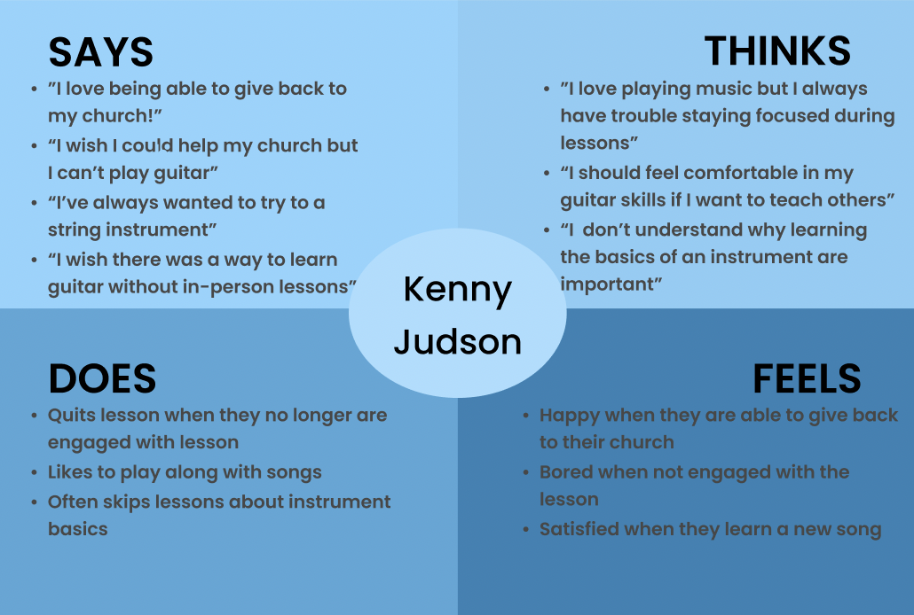

## Persona + Usage Scenario | DH 110 - Assignment 4 
#### Yahaira Cortez   

### &#128218; The Purpose of UX StoryTelling
UX StoryTelling allows the designer to "get insight into users, build empathy and reach them emotionally" (<a href="https://www.interaction-design.org/literature/topics/storytelling" target="_blank">cite</a>). Such stories are created from learning who their users are, what the needs of their users are, and how their product intends to meet the users' needs. More specifically, personas, empathy maps, and scenariors are created to visualize potential users and their needs. These stories allow for the designer to gain a deeper psychological understanding of their user.   
 

### &#128100; Personas + Empathy Maps 
#### 	Persona 1 - Kenny Judson 
    
#### Kenny's Empathy Map
  
#### Persona 2 - Raul Maciel
  
#### Raul's Empathy Map
    

### &#128506;&#65039; User Scenarios + Journey Maps
