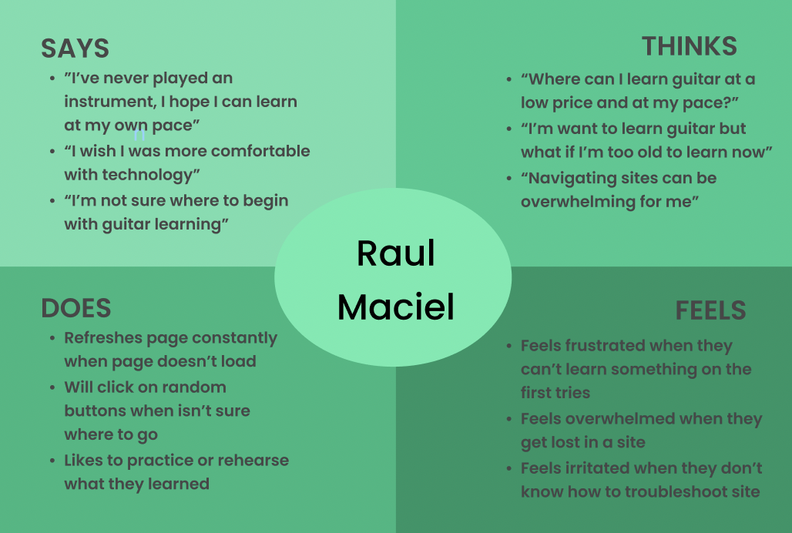

## Persona + Usage Scenario | DH 110 - Assignment 4 
#### Yahaira Cortez   

### &#128218; The Purpose of UX StoryTelling
UX StoryTelling allows the designer to "get insight into users, build empathy and reach them emotionally" (<a href="https://www.interaction-design.org/literature/topics/storytelling" target="_blank">cite</a>). Such stories are created from learning who their users are, what the needs of their users are, and how their product intends to meet the users' needs. More specifically, personas, empathy maps, and scenarios are created to visualize potential users and their needs. These stories allow for the designer to gain a deeper psychological understanding of their user.   
 

### &#128100; Personas + Empathy Maps 
#### 	Persona 1 - Kenny Judson 
    
#### Kenny's Empathy Map
  
#### Persona 2 - Raul Maciel
  
#### Raul's Empathy Map
    

### &#128506;&#65039; User Scenarios + Journey Maps  
#### Kenny's Scenario + Journey Map  
##### <i>Why</i> Kenny is Using the Product 
> Kenny is a 40 year-old pastor at his local church who lives in his hometown of Riverside with his wife and 2 children. The church he preaches at is the same church he grew up in. Because of his close relationship with the church, he always wants to give back. Since he learned how to play instruments in the church's music group when growing up, he figured the best way to give back is by contuing to support and perform with the church's music group during mass. Recently, the church lost a member who typically played guitar in the music group, therefore now the church is looking for a new guitarist. Kenny wants to help as much as he can in the search but thought he could also fill the part if he learned guitar. Kenny is open and motivated to learning guitar but is not too fond of the actual learning process, as he often gets bored during lessons. He also learned most of his other instruments from a friend or instructor. However, Kenny feels very satisfied when playing along to a tune or after learning a song. Kenny needs a music learning service where he can learn songs on guitar in an engaging manner and is similar to learning from an in-person instructor. 
##### <i>How</i> Kenny is Using the Product
> Because Kenny wants to learn Guitar and figured the Internet could provide him with a resource (because the Internet has everything), he was fortunate to stumble upon GuitarTricks. Since Kenny has prior music experience, he plans on learning guitar through learning songs. After logging into the site, Kenny looks for the songs tab to learn a song of his choice. Kenny then learns and plays along to the song of his choosing. During the song lessons, Kenny will often check his lesson progress by scrolling down to check on the lower right area of the page. 
 
  

#### Raul's Scenario + Journey Map  
##### <i>Why</i> Raul is Using the Product 
> Raul is a 60 year-old retired farming supervisor who lives in the small town of El Centro with his wife. As a working immigrant, he found most of his life consisted of working long laborous hours in order to support his family. After retirement, Raul finds endless time on his hands and hopes now to pursue hobbies he before found interesting. Raul also feels a lose of purpose after no longer being employed and hopes a hobby cause regain his sense of purpose. Raul has no particular goal in mind but simply hopes to learn the basics of guitar. Because of Covid-19 regulations and the music learning services surrounding his area, he finds an online music learning service may be his best option. However, Raul isn't as familar with technology as he wishes and often is frustrated when using technology. He hopes to find a user-friendly service that allows him to learn the basics of the guitar. If all goes well, he hopes to eventually play a song for his wife for their wedding anniversary. 
##### <i>How</i> Raul is Using the Product
> With the help of his daughters, Raul is brought to the GuitarTricks site, where he plans to learn the basics of guitar. Since Raul is a beginner, after logging into the site, Raul will click on the beginner lessons button. Raul is also unsure of where to begin his guitar journey, so he will then click on lesson 1 of Guitar Fundamentals option to begin learning the basics of guitar. When he is done learning for the day, Raul will click on the progress tab on the left side of the page to ensure he is on the right path of learning. 
 
  

 
### Reflection
I found it very interesting and even fun to put myself in the shoes of the users. It defintely influenced my perspective on the design of the product and allowed me to better understand how users intend to use the product and what may draw them to the product. It is fascinating to consider the efficiency of the product through a more psychological level.  
