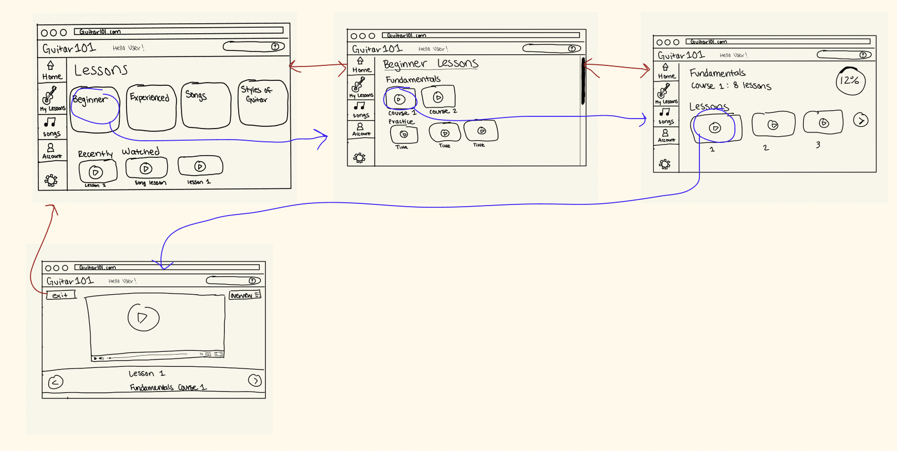

# Assignment 05 : Low-Fidelity Prototype 
 DH 110: User Experience Design  
 Yahaira Cortez 

## Overview 
### *Purpose*
The purpose of the low-fidelity prototype is a method of testing the product design through outlining the flow and navigation of the product. Low-fidelity testing checks functionality rather than the visual appearance of the product. Having users test the low-fidelity protype also allows the designer to ensure the usability and efficency of the product without considering other visual elements of the product. 

### *Product*
The low-fidelity prototype will be based on the GuitarTricks website. Using prior user research, the site will be redesigned to better meet the needs of its intended users. The inital step being the low-fidelity protoype where the navigation/usability changes will be applied and tested. 

The low-fidelity protype will test the proposed navigation and interface elements of the site since such components proved to be especially difficult for users when interacting with the product. 

## Tasks 
The low-fidelity prototype supports the following tasks:
1. Entering a Guitar Lesson
2. Checking Lesson Progress
3. Using Question Forum

## Wireframes & Wireflow
### Task 1: Entering a Guitar Lesson
    

### Task 2: Checking Lesson Progress
#### Method 1
    
#### Method 2
    

### Task 3: Using Question Forum
#### Method 1
    
#### Method 2
    

## Testing 
Participant was asked to complete the tasks based on the prototype. 

### Task 1 
    
*Confusions and/or unexpected interactions:* 
I expected the user to click on the lessons on the home page rather than the 'My Lessons' button on the sidebar. The user didn't seem confused when navigating the prototype to complete the task. 

### Task 2 
    
*Confusions and/or unexpected interactions:* 
I expected the user to click on the lessons on the home page rather than the 'My Lessons' button on the sidebar. The user didn't seem confused when navigating the prototype to complete the task. 

## Reflection

