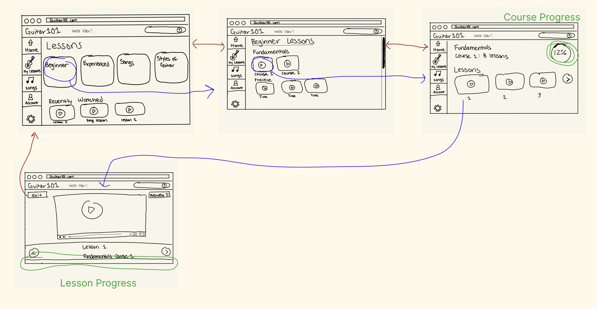

# Assignment 05 : Low-Fidelity Prototype 
 DH 110: User Experience Design  
 Yahaira Cortez 

## Overview 
### *Purpose*
The purpose of the low-fidelity prototype is a method of testing the product design through outlining the flow and navigation of the product. Low-fidelity testing checks functionality rather than the visual appearance of the product. Having users test the low-fidelity protype also allows the designer to ensure the usability and efficency of the product without considering other visual elements of the product. 

### *Product*
The low-fidelity prototype will be based on the GuitarTricks website. Using prior user research, the site will be redesigned to better meet the needs of its intended users. The inital step being the low-fidelity protoype where the navigation/usability changes will be applied and tested. 

The low-fidelity protype will test the proposed navigation and interface elements of the site since such components proved to be especially difficult for users when interacting with the product.  
 

## Tasks 
The low-fidelity prototype supports the following tasks:
1. Entering a Guitar Lesson
2. Checking Lesson Progress
3. Using Question Forum
 

## Wireframes & Wireflow
### Task 1: Entering a Guitar Lesson
    

### Task 2: Checking Lesson Progress
#### Method 1
    
#### Method 2
    

### Task 3: Using Question Forum
#### Method 1
    
#### Method 2
    
 

## Testing 
Participant was asked to complete the tasks based on the prototype. 

### Task 1 
    
*Confusions and/or unexpected interactions:* 
I expected the user to click on the lessons on the home page rather than the 'My Lessons' button on the sidebar. The user didn't seem confused when navigating the prototype to complete the task. 

### Task 2 
    
*Confusions and/or unexpected interactions:* 
Did not expect user to find progress using search bar. Besides inital confusion on beginning the task, they did not seemed confused in completing the task. 

### Task 3 
    
*Confusions and/or unexpected interactions:* 
User had most difficulties in Task 3. User used search bar but was unaware that question mark was a button that led to the site forum. In using the search bar for the forum, they were presented with too many options and got confused as to which option would bring them to the forum. 
  

## Reflection & Design Reccomendations
Overall, it was an interesting experience seeing the user interact and navigate the prototype. Similar to prior stages of the project, I gained more insight into the user's behavior. Through the tasks I gained a better understanding as to how the user intends to navigate the site, and how the design at the moment may not support easy user navigation. This is due to the difficulties the user faces during the tasks.  

I found it a bit difficult to create the wireflows as I did not have much prior experience, especially in needing to ensure all possible options of the wireflow. However, I did enjoy creating and designing the various wireframes for the prototype.   

Based on the user's participation in completing the tasks on the prototype I decided on more redesign possibilities:
- Make Forum more accesible - button with 'Forum' label next to search bar, 'Forum' option on sidebar, or remove search bar and include 'Search" or 'Help' option on sidebar and have option open to forum with search bar on top. 
- Have homepage show user's current lessons in progress rather than all options for lessons on homepage
- Have 'My Lessons' be changed to 'My Progress' where user can easily find all the lessons they've completed or are in progress
- Add 'Lessons' option therefore user is able to easily access all types of lessons rather than needing to refer back to the homepage.
- Combine 'Account' & 'My Lessons' tab and have it renamed 

