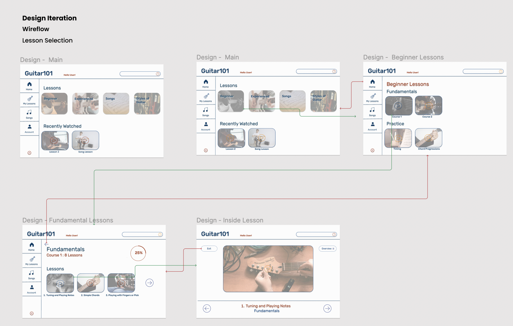
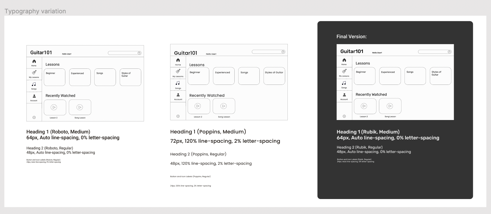
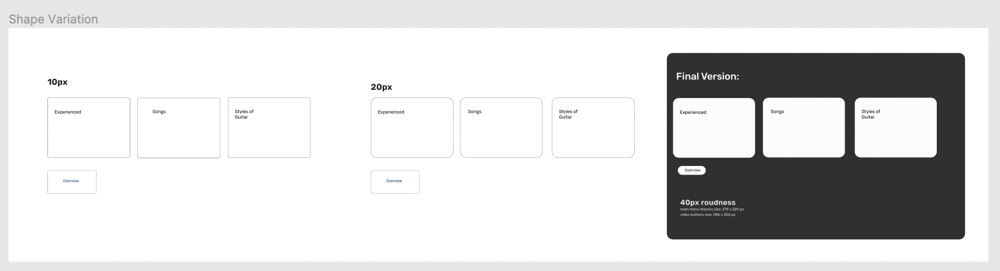
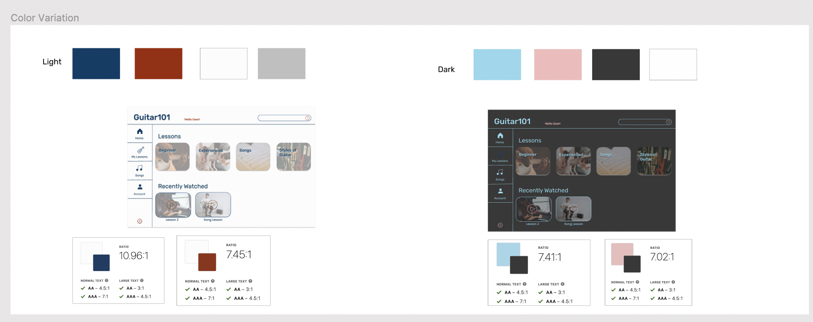
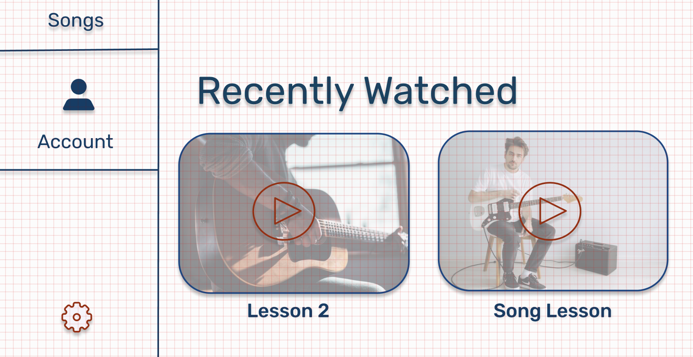
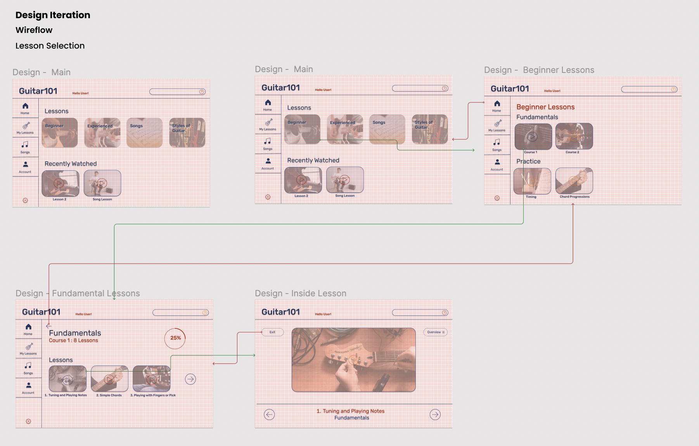

# Assignment 06: Interface Design
 DH 110: User Experience Design  
 Yahaira Cortez
 
 ## Project Brief & Key Tasks

### Purpose
The purpose of the project is to improve the <a href="https://www.guitartricks.com/home.php" target="_blank">Guitar Tricks </a> site to enhance site navigation and increase user accesiblity and engagement, while considering the site's mission and the needs of their audience. The <a href="https://www.guitartricks.com/home.php" target="_blank">Guitar Tricks </a> site is an online music learning resrouce for learning guitar and appeals to players of all levels and all ages. Therefore with the redesign, the site should be able to better accomodate to those who fall within the music learning category, regardless of age.  

The purpose of the interface design is to work towards finalizing the product design by converting low-fidelity designs to high-fidelity. The high-fidelity designs begin to consider the visual and interactive components of the product design. 

### Key Tasks 
Users of <a href="https://www.guitartricks.com/home.php" target="_blank">Guitar Tricks</a> should be able to:
 - Access and Complete any Guiar Lessons of their choosing (Fundamentals, Songs, Exercises, etc.)
 - Check their Lesson Progress
 - Utilize Question Forum 
 
## Interface

### Approach 
I approached the design with an empahsis on modern interface design and consideration for the target audience, middle-aged males, musicians or those seeking to learn music. For the high-fidelity design, I drew inspiration from the original <a href="https://www.guitartricks.com/home.php" target="_blank">Guitar Tricks</a> site as well as from <a href="https://app.flowkey.com/songs" target="_blank">FlowKey</a>, another online music learning resource. 

I used Figma to draft and finalize the high-fidelity designs. Because the site is for often used on a computer, I based my frame dimensions for the design off the screen dimensions of the Macbook Pro "14. 

### WireFrames & WireFlow
<a href="https://www.figma.com/file/3TI2Ngv9DapGHKVuJVa7Su/DH110---A06?node-id=10%3A271" target="_blank">Wireframe & Wireflow Design File</a>

### Design Interations 
Below is the entire view of the high-fidelity design. <a href="https://www.figma.com/file/3TI2Ngv9DapGHKVuJVa7Su/DH110---A06?node-id=0%3A1" target="_blank">Here</a> you can access the full view of the high-fidelity design and design element interations.  
   
 
In finalizing the high-fidelity design above, I iterated through different types of typography, colors, and shapes to test and evaluate the types of elements to use within the design.  

## Typography Iteration
  
My exploration of typography was based on whether they fit within the modern interface image and if they were more playful yet professional.  

I decided on Rubik because, in comparison to the others I explored, I felt it did well in moderninizng the feel of the interface while doing well in combining the playful or lighthearted elements with still a sharp, professional edge to it. The others I tried were either too round and seemed almost too playful or more geared towards a younger audience, while others felt more serious which took away from the fun and engaging nature of guitar learning content.  

## Shape Iteration
  
I knew when exploring the types of shapes to use within the interface I wanted to focus on more round shapes. More round shapes do well in creating a more modern feel to the site, versus sharp straight lines that can decrease engagment and again take away from the fun and engaging nature of the site's content.  

Because most of the site's contents are buttons or video thumbnails, I decided on a 40px roundness. Because we often associate buttons with more round edges, the shapes of the objects on the site not only contribute to the site's overall impression but also encourages users to press on the buttons, thus increasing user engagement. The 40px does well in softening the feel of the site, but is still sharp enough to maintain the slight professional tone of the site as some of guitar content is taught by well accomplished professionals.  

## Color Iteration & Accesibility
  

Because of the site's targeted audience, and our goal to appeal to middle-aged males, I wanted to ensure the site's colors were easily seen by those within the targeted group and those who may be visually impaired. I chose colors that contrasted well with eachother and were similar to the color scheme of the original site. I wanted the site to still have a pop of color while still maintaining it easy readablity and reducing any unncessary visual noise.  

I also tested the acessibilty of the design colors by measuring the color contrast between the colors.  

## Layout 
  
  

I created my high-fidelity design using a 10px grid. The grid helped ensure the cleanliness and uniformity of the site. For example, With the grid I ensured all button labels were always witin 3 grid spaces below the button.  

## Style Design 
The following is a summary of the finalized style design. 
  
  

### Impression Test
For the impression test, I used the same participant from the usability test as their experience with the original site could allow them to better determine whether the redesign has improved and better meets the user's needs, especially the concerns they mentioned during their test.  

I provided the participant with the style guide as well as a link to an interactive prototype of the site. In testing the new design the participant made a couple key points:
- Will there be more content material or will it typically only be filled with small amounts of content, such only the lesson buttons? 
- Will more colorful elements be added? The site appears mdoern and clean but is maybe lacking a bit of color or other elements?
- The actual usability of the site definitely improved and was much easier to navigate.
- I had a couple issues orginally with the question forum so I am glad to see how it was redesigned to be more easily usable 
- It is pretty consistent between pages but sort of differs once you start entering the lesson, is there a way to make it flow more easily? 
- The navigation bar on the side is pretty useful, espeically since it consistently is on the side, regardless of the page you're on.  

Summary: The participant was mostly satisfied with the new design interface of the site and felt only a couple components needed to be adjusted to better its usability. The participant especially appreciated the look of the site as the new interface online allowed easy navigation. They also commented that the site appeared more user-friendly for all groups of populations, especially for those who may have as much experience with technology. 
