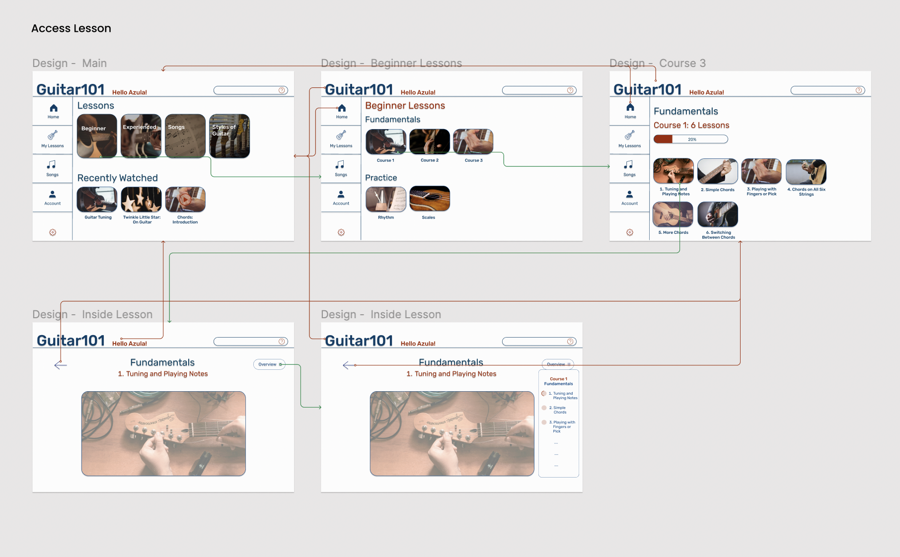
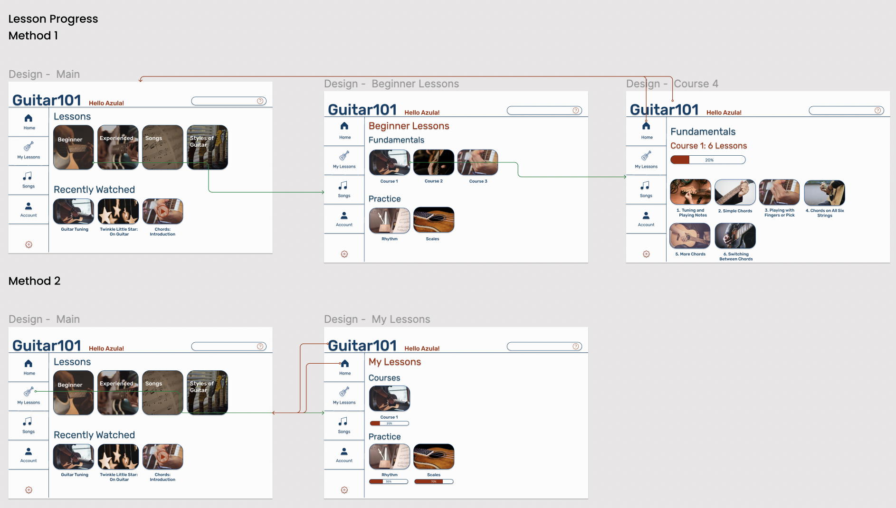
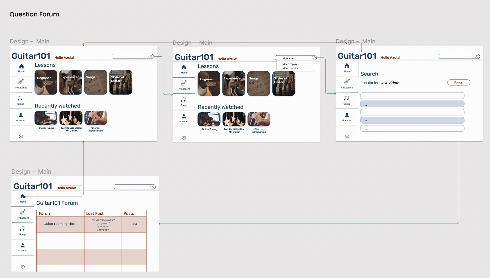

# Assignment 07: High-Fidelity Prototype
 DH 110: User Experience Design  
 Yahaira Cortez
  

 ## Project Brief & Key Tasks
 
 ### Purpose
 - project  
 
 The purpose of the high-fidelity prototype is to test* the design and interactive elements of the interface. 
 
 ### Key Tasks
 In using the high-fidelity prototype the user should be able to accomplish the same tasks as done in the Usability Test:
 - Access a lesson
 - Check Lesson Progress
 - Access and Search through Question Forum

## WireFlows

- <b>Task #1 </b>: Access a Lesson        
- <b> Task #2 </b>: Check Lesson Progress        
- <b> Task #3 </b>: Access and Search through Question Forum        

## High-Fidelity Prototype
- Link to Prototype: <a href="https://www.figma.com/proto/3TI2Ngv9DapGHKVuJVa7Su/DH110---A06?node-id=67%3A1358&scaling=scale-down&page-id=0%3A1&starting-point-node-id=67%3A1358&show-proto-sidebar=1" target="_blank">High-Fidelity Prototype</a>
 - Links to Recordings of Cognitive Walkthroughs for each Task:
    - <a href="https://drive.google.com/file/d/1LV_ujl_72ndYvVGmsh71PJccPnb7YVC5/view?usp=sharing" target="_blank"> Access a Lesson</a>
    - <a href="https://drive.google.com/file/d/1GoxptRw-swKPpgVsoc5lUmE5JybrXyzU/view?usp=sharing"> Check Lesson Progress </a>
    - <a href="https://drive.google.com/file/d/1SroQ2HVlB1pv64k67V8yCAdasApg767Z/view?usp=sharing"> Access Question Forum </a>

## Evaluation
- screenshots of old and new prototype

 
 
