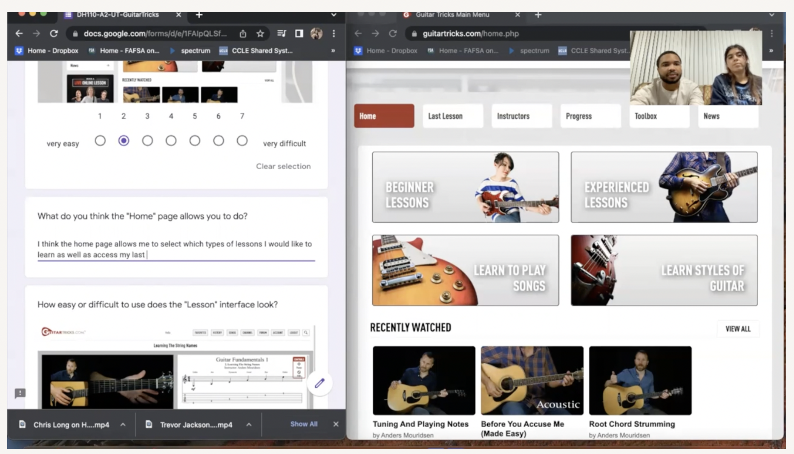
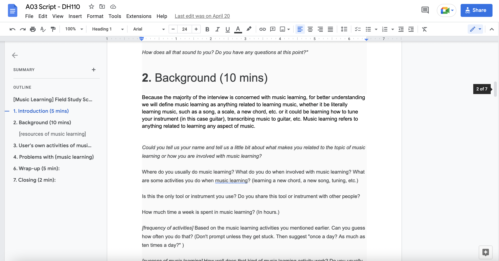
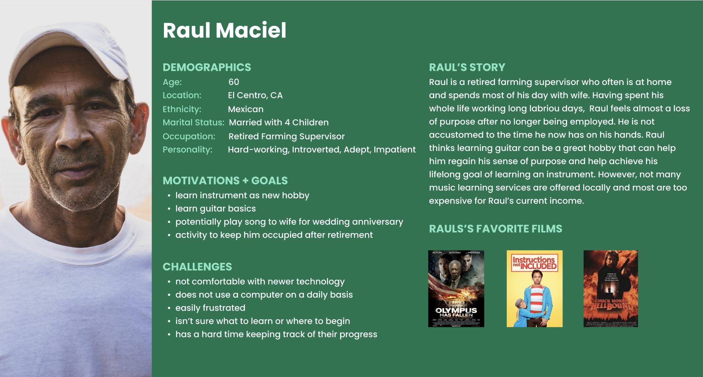
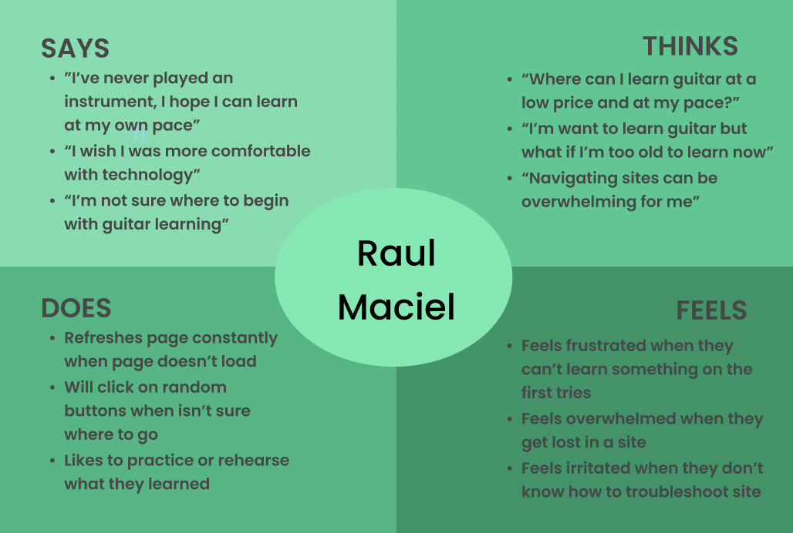
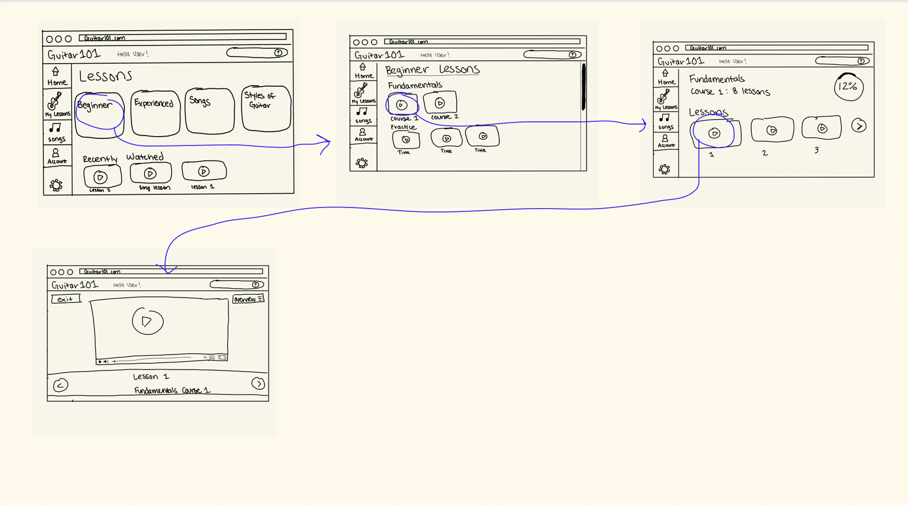
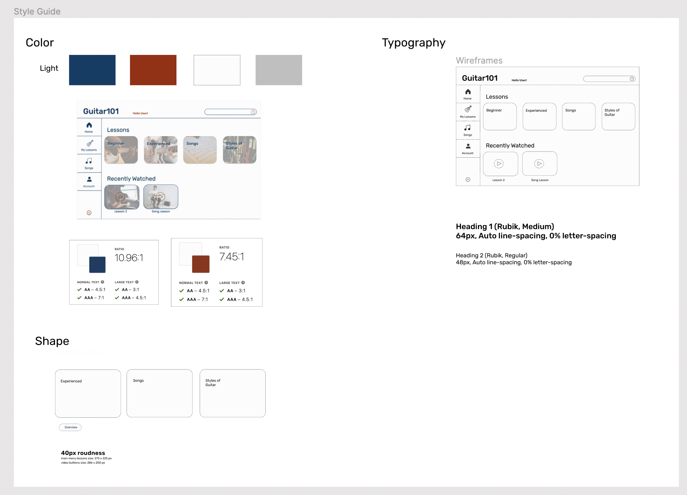

# Guitar101

DH 110: User Experience Design  
Yahaira Cortez
   

## Project Brief 

   

### Purpose
Whether it is a sense of nostalgia or simply a new curiosity, learning a musical instrument is a common hobby, and has been for decades. With the creation of the online music learning services, music learning has become much more accessible. However, the accessibility of such services may be hindered by how the technology of the service is utilized. 

The music learning service I will aim to improve for my UX project is <a href="https://www.guitartricks.com/" target="_blank">GuitarTricks.com</a>.
The Guitar Tricks site is an online music learning resource for learning guitar, and whose mission is to provide guitar learning services for all ages and all skill levels. With my UX project, 
I intend to enhance site navigation and increase user accessibility while ensuring the high quality of the musical teaching or music learning content. In creating the redesign of GuitarTricks, the site’s mission and the needs of their audience, such as technological gaps, will be taken into consideration. For the DH110 course,  my project will especially consider the needs of those who meet the following profile: Middle-Aged (40-60 years old), Employed, Males, Some Education. 

### Design Statement 
<b>Through my UX project, I hope to design a music learning service that is easy to navigate, regardless of technological familiarity with websites, easy to search, and, most importantly, engaging for learners. The design of the website should coincide with the site's mission - accessible to all ages and players of all skill levels. </b>  
  
After conducting usability testing and research (mentioned below), I decided to prioritze certain features of the site in the redesign:
  - <b> Minimizing Visual Noise </b>
  - <b> Modernizing Website Interface </b>
  - <b> Ensuring Key Tasks can be Easily Accomplished, Users can: </b>
    - Access Lessons
    - Access Lesson Progress
    - Question Forum/Search Bar can be accessed and utilized effectively   

## Competitor Analysis 
### Heuristic Evaluation
To understand how other music learning sites presented and performed, specifically those that were intended to teach musical instruments, I conducted heuritisic analysis on two instrument learning sites: <a href="https://www.guitartricks.com/" target="_blank">GuitarTricks.com</a> and <a href="https://www.flowkey.com/en" target="_blank">FlowKey.com</a>.    
&nbsp; &nbsp; &nbsp; &nbsp; &nbsp; &nbsp; &nbsp; &nbsp; &nbsp;  &nbsp;    
I chose to evaluate the sites because of how they differed in their design interface and their prominence within the realm of online music learning. The herusitic evaluations on the sites were conducted according to  <a href="https://www.nngroup.com/articles/ten-usability-heuristics/" target="_blank">10 Usability Heuristics for User Interface Design</a> and <a href="https://www.nngroup.com/articles/how-to-rate-the-severity-of-usability-problems/" target="_blank"> Severity Ratings for Usability Problems</a>.  
From the two online music learning services, I found I wanted to create a design that was a balance between the honorable qualities of each website - high quality lessons offered through a simple, modern interface. Both sites overall offered useful music learning tools, but certain aspects of the sites, such as interface design and variety in music lessons, were executed better between one or the other. Thus, I wanted an interface design that was inspired by the balance of the two sites, or a combination of the honorable qualities of each site.  

#### Read full Heuristic Evaluations <a href="https://github.com/yahairaycortez/DH110/tree/main/Assignment1" target="_blank"> here </a>.   

### Usability Testing 

  

After deciding to focus my UX project on the <a href="https://www.guitartricks.com/" target="_blank">GuitarTricks</a> site, I conducted a usability test to better understand the capabilities and design of the site. I had realized from the original heuristic evaluation that certain design violations were being made, however, I wanted to better understand the perspective a new user to the site and thus how such design violations may hinder a user's experience.  

After conducting the Usability Test, I found the extent of the usability issues with the website. In general, I found the issues with the site to be a bit more severe than I had anticipated as I noticed the participant experienced more difficulties with the site. For example, the participant had trouble locating the question forum and finding the ability to exit lesson, which are necessary features to ensure easy and safe navigation of the site. Additionally, because the user was not particularly representative of the targeted population (21-year old male, highly familar with techonology), I find the participant's difficulties with the site may be worse for those who do fall within the targeted audience. (middle-aged males, variety in levels of technological familarity).  

#### See full Usability Testing <a href="https://github.com/yahairaycortez/DH110/tree/main/Assignment2" target="_blank"> here </a>.   

### User Research 

    

In order to best meet the needs of the intended audience of the website, it was necessary to conduct user research on users who are expected to utilize the site. A 24 year-old male, intermediate guitar player, offered to provide insight into their guitar learning process, which includes the resources/tools they used to initally learn guitar and to strengthen their current skillset.  

Overall I felt the interview process did well in providing me with a better understanding of music learning, in general, and how many may approach the process of music learning. I felt I learned much more about the mind and behavior of the user and how one may approach the site when with intentions of learning guitar. I particularly enjoyed the interview since it was almost as if I was able to enter the mind one who is learning guitar, understand how they came to learn guitar, and in discovering which music learning methods work best for them. I was fortunate in that my participant did especially well in describing every thought or process ongoing inside their mind during their music learning sessions. I enjoyed this portion of the research process and found such research will be greatly beneficial in creating improvements to the GuitarTricks site.  

#### See full User Research <a href="https://github.com/yahairaycortez/DH110/tree/main/Assignment3" target="_blank"> here </a>.   

### UX StoryTelling
 &nbsp;     
UX StoryTelling allows the designer to "get insight into users, build empathy and reach them emotionally" (<a href="https://www.interaction-design.org/literature/topics/storytelling" target="_blank">cite</a>). Such stories are created from learning who their users are, what the needs of their users are, and how their product intends to meet the users' needs. More specifically, personas, empathy maps, and scenarios are created to visualize potential users and their needs. These stories allow for the designer to gain a deeper psychological understanding of their user.   
I found it very interesting and even fun to place myself in the shoes of the users. It greatly influenced my perspective on the design of the product and allowed me to further recognize how users intend to use the product and what may draw them to the product. It is fascinating to consider the efficiency of the product through a more psychological level. 

#### See full Personas + Mind Maps <a href="https://github.com/yahairaycortez/DH110/tree/main/Assignment4" target="_blank"> here </a>.   

### Wireframing & Low-Fidelity Prototype
    

The purpose of the low-fidelity prototype is a method of testing the product design through outlining the flow and navigation of the product. Low-fidelity testing checks functionality rather than the visual appearance of the product. Having users test the low-fidelity protype also allows the designer to ensure the usability and efficency of the product without considering other visual elements of the product.    
The low-fidelity prototype will be based on the GuitarTricks website. Using prior user research, the site will be redesigned to better meet the needs of its intended users. The inital step being the low-fidelity protoype where the navigation/usability changes will be applied and tested.  

The low-fidelity protype will test the proposed navigation and interface elements of the site since such components proved to be especially difficult for users when interacting with the product.

#### See full Low-Fidelity Prototype <a href="https://github.com/yahairaycortez/DH110/tree/main/Assignment5" target="_blank"> here </a>.   

### Interface Design
    

The purpose of the interface design is to work towards finalizing the product design by converting low-fidelity designs to high-fidelity. The high-fidelity designs begin to consider the visual and interactive components of the product design.   
I approached the design with an empahsis on modern interface design and consideration for the target audience, middle-aged males, musicians or those seeking to learn music. For the high-fidelity design, I drew inspiration from the original Guitar Tricks site as well as from FlowKey, another online music learning resource. 

I used Figma to draft and finalize the high-fidelity designs. Because the site is for often used on a computer, I based my frame dimensions for the design off the screen dimensions of the Macbook Pro "14.

